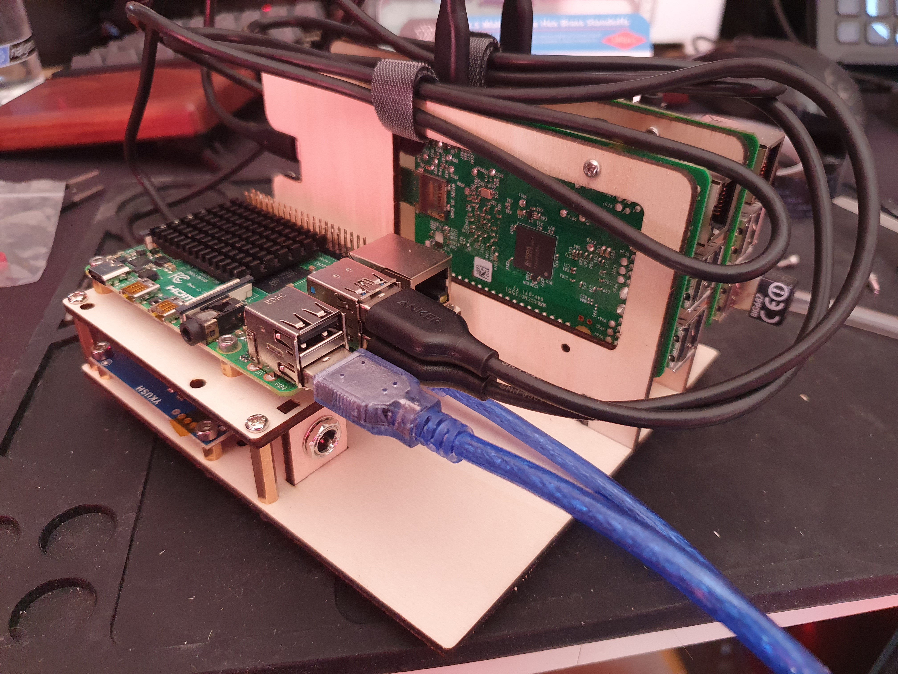

# Testrig

Testrig with two test Pis and one Pi4 as controller.

## BOM

### Lasercut parts

All to be cut out off 3mm thick Plywood. A3 size should suffice.

  * bottom-plate.svg
  * power-mount.svg
  * tray-controller.svg
  * 2 x tray-pi-and-sdmux.svg

### Electronics

  * [Yepkit YKUSH](https://www.yepkit.com/products/ykush)
  * 2 x [USB-SD-MUX](https://shop.linux-automation.com/usb_sd_mux-D02-R01-V02-C00-en)
  * 5.5x2.5mm female power connector
  * 5V/8A power supply with 5.5x2.5mm male connector
  * USB C power supply 5.1V/3A
  * 2 x RPi 2/3/4 as test Pis
  * RPi4 4GB as controller

### Cables

  * 4 x USB A to MicroUSB, 30cm
  * USB A to MiniUSB, 30cm

### Other

  * 12 x M2.5x6mm standoff
  * 4 x M3x6mm standoff
  * 4 x M3x20mm standoff
  * various M2.5 and M3 nuts and bolts
